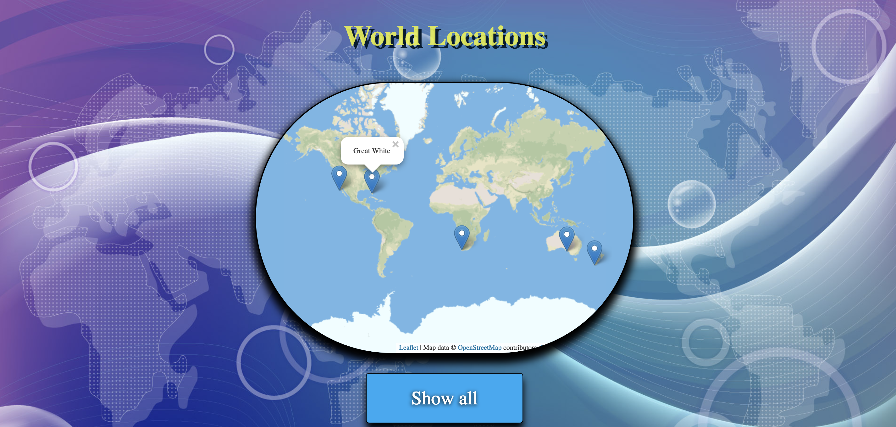

# Project Brief

## Education_app
_The BBC are looking to improve their online offering of_ _educational content by developing some interactive browser_ _applications that display information in a fun and interesting_ _way. Your task is to make an a Minimum Viable Product or_ _prototype to put forward to them - this may only be for a small_ _set of information, and may only showcase some of the features_ _to be included in the final app._

_Educational App - Homepage_

_Educational App - sharks page_

_Educational App - sharks info_

_Educational App - Shark quiz_

_Educational App - Shark location_

_Educational App - Big Cat page

_Educational App - Big Cat info_

_Educational App - Big Cat page_

_Educational App - Big cat location_

_Educational App - Maths quiz_

_Educational App - Maths quiz test_

# education_app
_This was a group Project where our goal was to goal was to_ _create an educational app where children could learn and then_ _test themselves to consolidate knowledge._

_Requirements, MongoDB running in your terminal and nodemon_ _which can be installed while in server folder with npm i nodemon_

# To run the app:

_ using terminal navigate to the server folder_
_ type npm install_
_ type mongod_
_ type npm run seeds_
_ type npm run server:dev / Server should now be running_
_ open a new terminal Window CMD + T_
_ navigate to the client folder ../client_
_ type npm install_
_ type npm run dev_
_ The app should now be running_
_ If it does not automatically show up the address is http://localhost:8080/_
